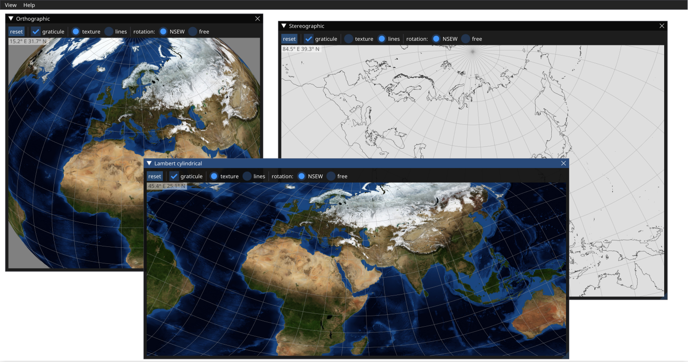

# Map Projections
Copyright (C) 2022 Filip Szczerek (ga.software@yahoo.com)

*This program is licensed under MIT license (see LICENSE.txt for details).*

----------------------------------------



## Instructions

To run the program: install the Rust toolchain, clone the source code and execute in the source directory:
```
$ cargo run --release
```

## Datasets

Earth topo- and bathygraphy texture courtesy of NASA.

Earth vector map courtesy of Natural Earth (https://www.naturalearthdata.com, https://github.com/nvkelso/natural-earth-vector).